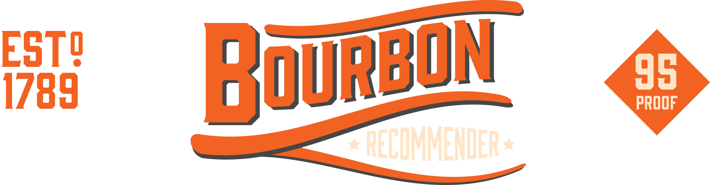
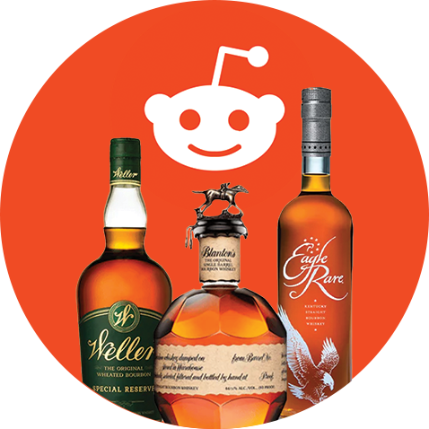

# 🧐 What is this app?

**This app uses machine learning methods to recommend bottles of bourbon to a user based on their preferences across other bourbons.** 

<table style="border-collapse:collapse; border-width:0px">
<tr>
<td>
As a budding bourboneer, it can be difficult to parse out what particular bourbons one likes/dislikes, and why that might be the case. Bourbons can be distilled with varying percentages of rye, wheat, barley and corn in their mashbills, finished in different ways to bring out specific flavors/notes, and aged between 3-25 years to produce a unique taste. 
  
The features of a bourbon can also be very subjective, as notes tasted by one person may not be shared by another. However, by synthesizing review data across bottles from [r/bourbon](https://www.reddit.com/r/bourbon/) using the **Reddit API**, this app can extract key features from bourbons and use this information to make recommendations to users. 
</td>
<td width="40%" align="center">

</td>
</tr>
</table>